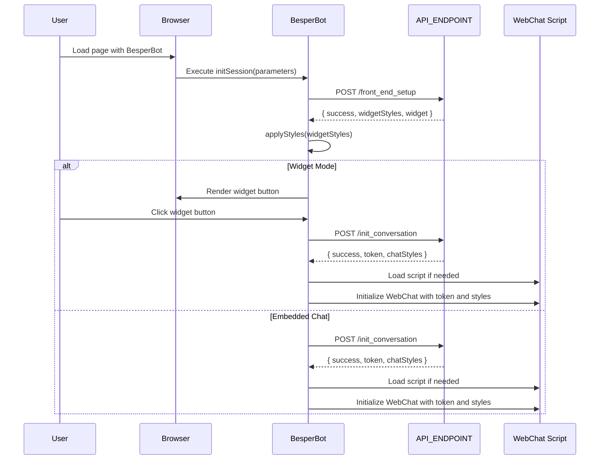

# BesperBot Documentation

**Version:** 1.0.0  
**Dependencies:** [Microsoft Bot Framework Web Chat](https://github.com/microsoft/BotFramework-WebChat)

## Table of Contents

1. [Overview](#overview)
2. [Installation](#installation)
3. [Initialization](#initialization)
4. [Structure of `index.js`](#structure-of-indexjs)
    - [Module Pattern](#module-pattern)
    - [Core Functions](#core-functions)
5. [Flow Diagram](#flow-diagram)
6. [API Endpoints and Sample Payloads](#api-endpoints-and-sample-payloads)
    - [`front_end_setup`](#front_end_setup)
    - [`init_conversation`](#init_conversation)
7. [Customization Options](#customization-options)
    - [Widget Styles](#widget-styles)
    - [Chat Styles](#chat-styles)
8. [Usage Example](#usage-example)
9. [Troubleshooting](#troubleshooting)
10. [License](#license)

---

## Overview

**BesperBot** is a JavaScript library that integrates a chatbot into your website using the Microsoft Bot Framework Web Chat. It provides an easy way to initialize and customize the chatbot, whether as an embedded chat or a floating widget.

---

## Installation

To get started with BesperBot, follow these steps:

1. **Include the BesperBot Script**

   ```html
   <script src="path/to/besperbot.js"></script>
   ```

2. **Include the Microsoft Bot Framework Web Chat Script**

   ```html
   <script src="https://cdn.botframework.com/botframework-webchat/latest/webchat.js"></script>
   ```

3. **Initialize the Chatbot**

   ```html
   <div id="chat-container"></div>
   
   <script>
     BesperBot.initSession({
       id: 'your-bot-id',
       containerId: 'chat-container',
       widget: true
     });
   </script>
   ```

---

## Initialization

To initialize the chatbot session, use the `initSession` method provided by the BesperBot library. This method sets up the chatbot either as a floating widget or as an embedded chat interface based on the provided parameters.

```javascript
BesperBot.initSession({
  id: 'your-bot-id', // Required: The bot identifier
  containerId: 'chat-container', // Required: The ID of the container element
  widget: true // Required: Set to true for widget mode, false for embedded chat
});
```

---

## Structure of `index.js`

The `index.js` file is the core of the BesperBot library, encapsulating all functionalities required to initialize and render the chatbot. It follows the Universal Module Definition (UMD) pattern to support various module loaders.

### Module Pattern

```javascript
(function (root, factory) {
    // UMD boilerplate
}(typeof self !== 'undefined' ? self : this, function () {
    // Module code
}));
```

### Core Functions

1. **`initSession`**
   - **Description:** Initializes the chatbot session.
   - **Parameters:** 
     - `id` (string): Bot identifier.
     - `containerId` (string): ID of the container element.
     - `widget` (boolean): Flag to render as widget or embedded chat.

2. **`callFrontEndSetup`**
   - **Description:** Calls the `front_end_setup` API to retrieve widget styles and configuration.
   - **Parameters:** 
     - `botId` (string): Bot identifier.

3. **`initConversation`**
   - **Description:** Initializes the conversation by calling the `init_conversation` API.
   - **Parameters:** 
     - `botId` (string): Bot identifier.
     - `containerId` (string): ID of the container element.

4. **`applyStyles`**
   - **Description:** Applies styles to the chatbot elements based on API response.
   - **Parameters:** 
     - `widgetStyles` (object): Styles for the widget and chat container.

5. **`renderWidget`**
   - **Description:** Renders the widget button and chat container.
   - **Parameters:** 
     - `container` (HTMLElement): The container element.
     - `botId` (string): Bot identifier.
     - `widgetStyles` (object): Styles for the widget.

6. **`renderChat`**
   - **Description:** Renders the chat interface within the container.
   - **Parameters:** 
     - `container` (HTMLElement): The container element.
     - `data` (object): Conversation data including token and styles.

7. **`loadWebChatScript`**
   - **Description:** Dynamically loads the Web Chat script if not already loaded.
   - **Parameters:** 
     - `callback` (function): Callback to execute once the script is loaded.

8. **`initializeWebChat`**
   - **Description:** Initializes the Web Chat interface with provided token and styles.
   - **Parameters:** 
     - `container` (HTMLElement): The container element.
     - `token` (string): Direct Line token.
     - `styles` (object): Chat styles.
     - `customization` (object, optional): Customization options.

9. **Helper Functions**
   - `getBorderRadius(shape, customRadius)`
   - `setWidgetPosition(element, position)`
   - `setContainerPosition(element, position)`

---

## Flow Diagram

The following Mermaid diagram illustrates the sequence of operations when initializing a BesperBot session.



---

## API Endpoints and Sample Payloads

BesperBot interacts with two main API endpoints: `front_end_setup` and `init_conversation`. Below are the details and sample payloads for each.

### `front_end_setup`

**Endpoint:** `https://b-esper-apim.azure-api.net/dev/sessions/initiate`

**Action:** `front_end_setup`

**Description:** Retrieves widget styles and configuration settings for the chatbot.

**Request Payload:**

```json
{
  "product": "directline-access",
  "action": "front_end_setup",
  "data": {
    "bot-identifier": "your-bot-id"
  }
}
```

**Sample Response:**

```json
{
  "success": true,
  "widgetStyles": {
    "width": "400px",
    "height": "600px",
    "backgroundColor": "#ffffff",
    "bubbleBorderRadius": "10px",
    "fontFamily": "Arial, sans-serif",
    "fontSize": "14px",
    "textContentColor": "#000000",
    "widgetWidth": "60px",
    "widgetHeight": "60px",
    "widgetBackgroundColor": "#0078d4",
    "widgetColor": "#ffffff",
    "messagePadding": "10px",
    "bubbleBorderColor": "#cccccc"
  },
  "widget": true
}
```

### `init_conversation`

**Endpoint:** `https://b-esper-apim.azure-api.net/dev/sessions/initiate`

**Action:** `init_conversation`

**Description:** Initializes the conversation by obtaining a Direct Line token and chat styles.

**Request Payload:**

```json
{
  "product": "directline-access",
  "action": "init_conversation",
  "data": {
    "bot-identifier": "your-bot-id"
  }
}
```

**Sample Response:**

```json
{
  "success": true,
  "token": "DIRECT_LINE_TOKEN",
  "chatStyles": {
    "backgroundColor": "#f5f5f5",
    "bubbleBorderRadius": "8px",
    "bubbleBorderColor": "#dddddd",
    "fontFamily": "Segoe UI, sans-serif",
    "fontSize": "13px",
    "textContentColor": "#333333"
  },
  "containerId": "chat-container"
}
```

---

## Customization Options

BesperBot offers a range of customization options to tailor the appearance and behavior of both the widget and the chat interface. These options can be modified through the `initSession` method and within the `initializeWebChat` function.

### Widget Styles

Customize the floating widget button and chat container using the `widgetStyles` and `customization` parameters.

| **Variable**                     | **Description**                                     | **Type**  | **Default**    |
|----------------------------------|-----------------------------------------------------|-----------|----------------|
| `width`                          | Width of the chat container                         | `string`  | `400px`        |
| `height`                         | Height of the chat container                        | `string`  | `600px`        |
| `backgroundColor`                | Background color of the chat container              | `string`  | `#ffffff`      |
| `bubbleBorderRadius`             | Border radius of chat bubbles                       | `string`  | `10px`         |
| `fontFamily`                     | Font family used in the chat                        | `string`  | `Arial, sans-serif` |
| `fontSize`                       | Font size used in the chat                          | `string`  | `14px`         |
| `textContentColor`               | Text color used in the chat                         | `string`  | `#000000`      |
| `widgetWidth`                    | Width of the widget button                          | `string`  | `60px`         |
| `widgetHeight`                   | Height of the widget button                         | `string`  | `60px`         |
| `widgetBackgroundColor`          | Background color of the widget button               | `string`  | `#0078d4`      |
| `widgetColor`                    | Icon color of the widget button                     | `string`  | `#ffffff`      |
| `messagePadding`                 | Padding inside chat messages                        | `string`  | `10px`         |
| `bubbleBorderColor`              | Border color of chat bubbles                        | `string`  | `#cccccc`      |

### Chat Styles

Further customize the chat interface via the `chatStyles` and `customization` parameters passed to `initializeWebChat`.

| **Variable**                       | **Description**                                     | **Type**  | **Default**    |
|------------------------------------|-----------------------------------------------------|-----------|----------------|
| `backgroundColor`                  | Background color of the chat interface              | `string`  | `#f5f5f5`      |
| `bubbleBorderRadius`               | Border radius of chat bubbles                       | `string`  | `8px`          |
| `bubbleBorderColor`                | Border color of chat bubbles                        | `string`  | `#dddddd`      |
| `fontFamily`                       | Font family used in the chat                        | `string`  | `Segoe UI, sans-serif` |
| `fontSize`                         | Font size used in the chat                          | `string`  | `13px`         |
| `textContentColor`                 | Text color used in the chat                         | `string`  | `#333333`      |

### Customization Parameters

Additional customization parameters can be provided to fine-tune the widget and chat container.

| **Variable**                        | **Description**                                     | **Type**  | **Default**    |
|-------------------------------------|-----------------------------------------------------|-----------|----------------|
| `widgetZIndex`                      | Z-index of the widget button                        | `number`  | `1001`         |
| `widgetShape`                       | Shape of the widget button (`circle`, `square`, `rounded-square`) | `string` | `circle` |
| `widgetCustomBorderRadius`          | Custom border radius for widget button              | `string`  | `8px`          |
| `widgetRotation`                    | Rotation angle of the widget button in degrees      | `number`  | `0`            |
| `widgetScale`                       | Scale factor for the widget button                  | `number`  | `1`            |
| `widgetBoxShadow`                   | Box shadow style for the widget button              | `string`  | `0 4px 8px rgba(0, 0, 0, 0.2)` |
| `widgetBorderWidth`                 | Border width for the widget button                  | `string`  | `0px`          |
| `widgetBorderColor`                 | Border color for the widget button                  | `string`  | `transparent`  |
| `widgetBorderStyle`                 | Border style for the widget button                  | `string`  | `none`         |
| `widgetOpacity`                     | Opacity of the widget button                        | `number`  | `1`            |
| `widgetGradient`                    | Background gradient of the widget button            | `string`  | `none`         |
| `widgetBackgroundImage`             | Background image for the widget button              | `string`  | `none`         |
| `widgetMarginX`                     | Horizontal margin for the widget button             | `number`  | `0`            |
| `widgetMarginY`                     | Vertical margin for the widget button               | `number`  | `0`            |
| `widgetPosition`                    | Position of the widget button (`bottom-right`, `bottom-left`, `top-right`, `top-left`) | `string` | `bottom-right` |
| `containerZIndex`                   | Z-index of the chat container                       | `number`  | `1000`         |
| `containerBorderWidth`              | Border width of the chat container                  | `string`  | `0px`          |
| `containerBorderColor`              | Border color of the chat container                  | `string`  | `transparent`  |
| `containerBorderStyle`              | Border style of the chat container                  | `string`  | `none`         |
| `containerBoxShadow`                | Box shadow style for the chat container             | `string`  | `0 4px 16px rgba(0, 0, 0, 0.2)` |
| `containerBackgroundGradient`       | Background gradient of the chat container           | `string`  | `none`         |
| `containerBackgroundImage`          | Background image for the chat container             | `string`  | `none`         |
| `containerMarginX`                  | Horizontal margin for the chat container            | `number`  | `0`            |
| `containerMarginY`                  | Vertical margin for the chat container              | `number`  | `0`            |
| `containerMinWidth`                 | Minimum width of the chat container                 | `string`  | `none`         |
| `containerMaxWidth`                 | Maximum width of the chat container                 | `string`  | `none`         |
| `containerMinHeight`                | Minimum height of the chat container                | `string`  | `none`         |
| `containerMaxHeight`                | Maximum height of the chat container                | `string`  | `none`         |
| `containerPosition`                 | Position of the chat container (`bottom-right`, `bottom-left`, `top-right`, `top-left`) | `string` | `bottom-right` |

---

## Usage Example

Below is an example of how to initialize BesperBot with customized widget and chat styles.

```html
<!DOCTYPE html>
<html lang="en">
<head>
    <meta charset="UTF-8">
    <title>BesperBot Integration</title>
    <script src="https://cdn.botframework.com/botframework-webchat/latest/webchat.js"></script>
    <script src="path/to/besperbot.js"></script>
    <style>
        /* Optional: Additional styling */
    </style>
</head>
<body>
    <div id="chat-container"></div>

    <script>
        BesperBot.initSession({
            id: 'your-bot-id',
            containerId: 'chat-container',
            widget: true, // Set to false for embedded chat
            customization: {
                widgetZIndex: 2000,
                widgetShape: 'rounded-square',
                widgetCustomBorderRadius: '15px',
                widgetRotation: 0,
                widgetScale: 1,
                widgetBoxShadow: '0 4px 12px rgba(0, 0, 0, 0.3)',
                widgetBorderWidth: '2px',
                widgetBorderColor: '#ffffff',
                widgetBorderStyle: 'solid',
                widgetOpacity: 0.9,
                widgetGradient: 'linear-gradient(45deg, #0078d4, #00c6ff)',
                widgetMarginX: 10,
                widgetMarginY: 20,
                widgetPosition: 'bottom-right',
                containerZIndex: 1999,
                containerBorderWidth: '1px',
                containerBorderColor: '#cccccc',
                containerBorderStyle: 'solid',
                containerBoxShadow: '0 4px 16px rgba(0, 0, 0, 0.2)',
                containerBackgroundGradient: 'linear-gradient(to top, #ffffff, #f0f0f0)',
                containerMarginX: 15,
                containerMarginY: 25,
                containerMinWidth: '300px',
                containerMaxWidth: '500px',
                containerMinHeight: '400px',
                containerMaxHeight: '700px',
                containerPosition: 'bottom-right'
            }
        });
    </script>
</body>
</html>
```

---

## Troubleshooting

### Common Issues

| **Issue**                                   | **Description**                                         | **Solution**                                                                            |
|---------------------------------------------|---------------------------------------------------------|------------------------------------------------------------------------------------------|
| WebChat Script Not Loaded                   | The Microsoft Bot Framework Web Chat script isn't loaded.| Ensure that the Web Chat script is correctly included in your HTML before BesperBot.      |
| Missing Container Element                   | The specified container ID does not exist in the DOM.   | Verify that the `containerId` provided exists in your HTML.                              |
| API Calls Failing                           | API endpoints return errors or invalid responses.       | Check network connectivity and ensure the API endpoint URLs are correct.                  |
| Chatbot Not Displaying                      | The chat widget or embedded chat does not appear.       | Inspect the browser console for errors and verify that styles are applied correctly.      |
| Custom Styles Not Applied                   | Customization options do not reflect in the UI.         | Ensure that customization parameters are correctly passed and valid CSS values are used.   |

### Debugging Steps

1. **Check Browser Console:** Look for any error messages that can indicate missing scripts or incorrect parameters.

2. **Verify API Responses:** Use browser developer tools to inspect network requests and ensure that API responses are as expected.

3. **Validate Parameters:** Ensure that all required parameters (`id`, `containerId`, `widget`) are provided and correctly formatted.

4. **Inspect DOM Elements:** Verify that the widget button and chat container are correctly rendered in the DOM.

5. **Review Customization Options:** Ensure that the customization variables use valid CSS values and that there are no typos.

---