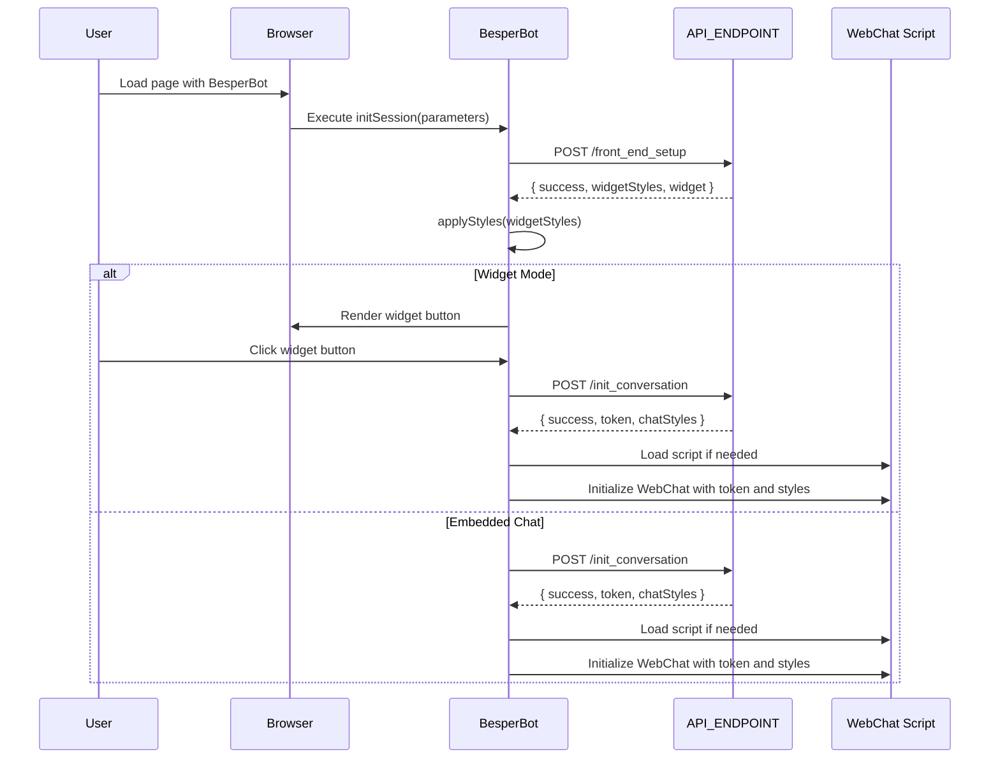

# BesperBot Developer Guide

Welcome to the BesperBot integration guide. This document will help you embed the BesperBot chatbot into your web application using the provided JavaScript library.

## Overview

BesperBot is a JavaScript library that integrates a chatbot into your website using the Microsoft Bot Framework. It allows for seamless communication with users, supporting multilingual interactions based on the user's browser settings. The chatbot begins each session with a mandatory data policy message followed by a customizable welcome message configured on [b-esper.com](https://b-esper.com).

## Prerequisites

- **An active account on [b-esper.com](https://b-esper.com).**
- **An active chatbot with a unique identifier (`botId`), obtainable from the Chatbot Overview section on your account.**
- **Basic knowledge of HTML and JavaScript.**
- **Internet access to load external scripts and styles.**

## Integration Steps

Follow these steps to integrate BesperBot into your web page:

### 1. Set Up the HTML Structure

Create a basic HTML file or use an existing one:

```html
<!DOCTYPE html>
<html lang="en">
<head>
    <meta charset="UTF-8">
    <title>Your Web Page Title</title>
    
    <!-- Load BesperBot Styles -->
    <link rel="stylesheet" href="https://unpkg.com/besperbot@1.0.4/styles.css">
</head>
<body>
    <!-- Container for the chatbot -->
    <div id="bsp_chatbot-container"></div>

    <!-- Scripts will be loaded before the closing body tag -->
</body>
</html>
```

### 2. Load Required Scripts

BesperBot relies on the Microsoft Bot Framework Web Chat library. Load both the Web Chat script and the BesperBot library:

```html
<!-- Load Microsoft Bot Framework Web Chat -->
<script src="https://cdn.botframework.com/botframework-webchat/latest/webchat.js"></script>

<!-- Load BesperBot Library -->
<script src="https://unpkg.com/besperbot@1.0.3/index.js"></script>
```

**Ensure these scripts are placed after the chatbot container in your HTML file.**

### 3. Initialize BesperBot

After loading the scripts, initialize the BesperBot session:

```html
<script>
    window.addEventListener('load', function() {
        if (window.BesperBot) {
            window.BesperBot.initSession({
                id: 'your_bot_id_here',
                containerId: 'bsp_chatbot-container',
                widget: true
            }).catch(error => {
                console.error('Failed to initialize BesperBot:', error);
            });
        } else {
            console.error('BesperBot failed to load');
        }
    });
</script>
```

**Replace `'your_bot_id_here'` with the actual `botId` from your Besper account.**

### 4. Customize Chatbot Appearance (Optional)

You can customize the appearance of the chatbot by:

- **Modifying the CSS:** Update the `styles.css` file or override styles in your own CSS to change the look and feel.
- **Passing Additional Parameters:** Pass additional parameters to the `initSession` method for further customization.

**Widget Parameter:**

- **`widget: true`** - A widget button appears on your web page, which users can click to open the chatbot.
- **`widget: false`** - The chatbot will be embedded directly where the container is placed.

### 5. Session Initialization Workflow

Upon calling `initSession`, the following sequence occurs:



### 6. Multilingual Support

BesperBot automatically detects the user's browser language settings and adjusts the chatbot language accordingly. This ensures a localized experience for users from different regions.

### 7. Mandatory Data Policy Message

At the start of each session, the chatbot displays a mandatory data policy message, ensuring compliance with data protection regulations. Following this, the welcome message configured in your Besper account is displayed.

## Customization and Configuration

For advanced customization, you can:

- **Modify Styles:** Update the `styles.css` file or override styles in your own CSS to change the look and feel.
- **Configure Messages:** Set up and customize the welcome message, data policy text, and chatbot responses through your account on [b-esper.com](https://b-esper.com).
- **Knowledge Base:** Enhance the chatbot's knowledge base and behavior by adding FAQs, intents, and entities in your Besper account.

## Support and Contact

If you have any questions or need assistance:

- **Support Tickets:** Create a support ticket on [b-esper.com](https://b-esper.com).
- **Email:** Contact us at [wolfgangsperger@besperai.com](mailto:wolfgangsperger@besperai.com).

Thank you for choosing BesperBot for your chatbot solution. We are committed to providing the best experience for both developers and users. Happy coding!

---

### Complete Code Snippets

#### HTML Structure

```html
<!DOCTYPE html>
<html lang="en">
<head>
    <meta charset="UTF-8">
    <title>Your Web Page Title</title>
    
    <!-- Load BesperBot Styles -->
    <link rel="stylesheet" href="https://unpkg.com/besperbot@1.0.4/styles.css">
</head>
<body>
    <!-- Container for the chatbot -->
    <div id="bsp_chatbot-container"></div>

    <!-- Scripts will be loaded before the closing body tag -->
</body>
</html>
```

#### Loading Scripts and Initializing BesperBot

```html
<!-- Load Microsoft Bot Framework Web Chat -->
<script src="https://cdn.botframework.com/botframework-webchat/latest/webchat.js"></script>

<!-- Load BesperBot Library -->
<script src="https://unpkg.com/besperbot@1.0.4/index.js"></script>

<script>
    window.addEventListener('load', function() {
        if (window.BesperBot) {
            window.BesperBot.initSession({
                id: 'your_bot_id_here',
                containerId: 'bsp_chatbot-container',
                widget: true
            }).catch(error => {
                console.error('Failed to initialize BesperBot:', error);
            });
        } else {
            console.error('BesperBot failed to load');
        }
    });
</script>
```

**Remember to replace `'your_bot_id_here'` with your actual `botId`.**