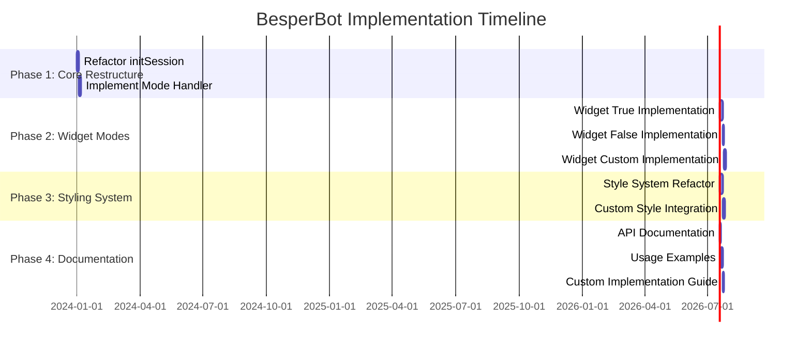
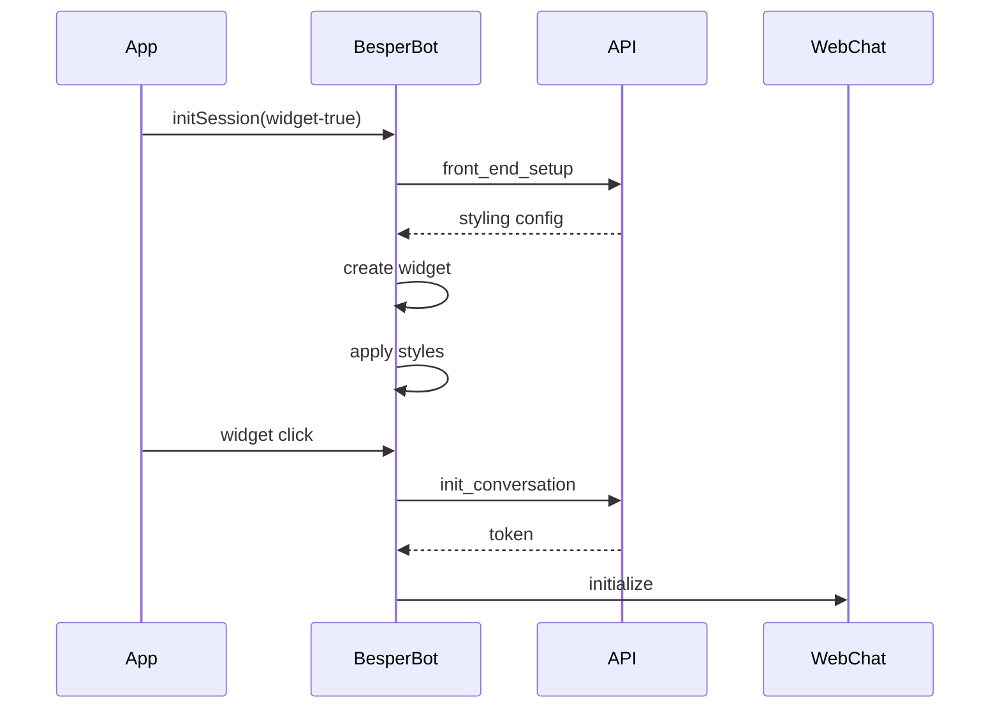
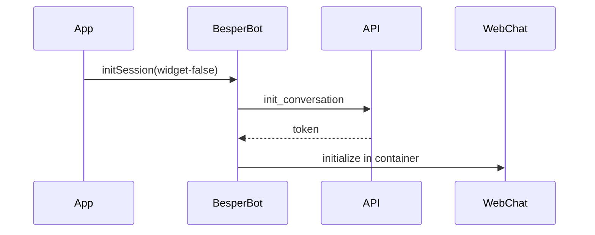
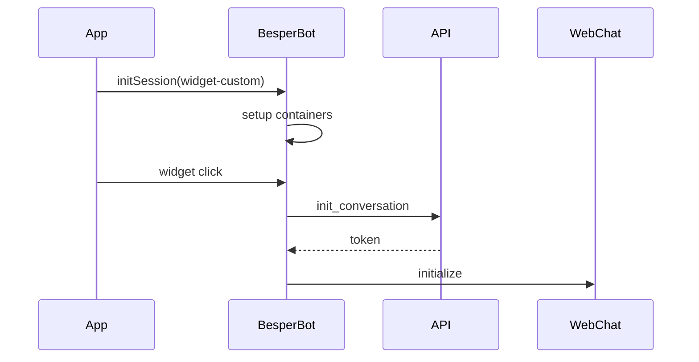

# BesperBot Library Restructuring Plan

## Current Issues
1. Widget false mode still shows widget button
2. Chat container appears in wrong location with widget false
3. No clear separation between widget true/false/custom modes
4. Styling application is too rigid
5. No clear documentation for custom implementations

## Requirements Analysis

### Widget True Mode
- Must call front_end_setup API
- Apply backend-provided styles to widget and chat container
- Create widget button with provided styling
- Handle widget visibility toggling
- Initialize chat only on first widget click

### Widget False Mode
- Skip widget button creation entirely
- Initialize chat immediately in provided container
- Optional front_end_setup call for styling
- Allow custom container positioning/styling
- Direct initialization of WebChat in specified container

### Widget Custom Mode
- Provide necessary container IDs to developer
- Minimal styling from library
- Handle only core functionality (visibility toggle, chat initialization)
- Allow complete style override
- Document required HTML structure

## Function Modifications Required

1. `initSession`
```javascript
// Current
async function initSession({ id, containerId, widget })

// Proposed
async function initSession({ 
  id, 
  containerId, 
  mode = 'widget-true', // 'widget-true' | 'widget-false' | 'widget-custom'
  customConfig = {} 
})
```

2. `renderWidget`
- Split into separate functions for each mode
- Remove direct style applications
- Add support for custom element IDs

3. `applyStyles`
- Make styling optional
- Allow style override through customConfig
- Separate widget and chat container styling

4. `renderChat`
- Support direct container rendering
- Allow custom styling
- Maintain WebChat core functionality

## Implementation Timeline



## Required Changes Per Mode

### Widget True


### Widget False


### Widget Custom


## Migration Strategy

1. Create new version with backward compatibility
2. Document breaking changes
3. Provide migration guide
4. Release beta for testing
5. Full release with examples

## Testing Requirements

1. Unit tests for each mode
2. Integration tests for API calls
3. Style application tests
4. Custom implementation tests
5. Browser compatibility tests

## Documentation Deliverables

1. API Reference
2. Mode-specific guides
3. Custom implementation examples
4. Style override guide
5. Migration guide

This plan ensures a structured approach to implementing the three modes while maintaining the core functionality and API compatibility. The timeline suggests a phased implementation that can be tested and validated at each stage.